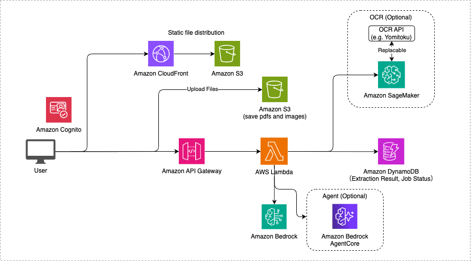

# AutoExtract

AutoExtract は OCR + Bedrock を活用した帳票読み取りの AI-OCR ソリューションです。帳票からの情報抽出を半自動化し、人間によるデータ入力チェックをサポートするツールです。

## ディレクトリ構造

```
.
├── agentcore/                    # エージェント機能（MCP 対応）
├── assets/                       # 静的アセット（マスタデータ、スキーマ定義）
├── bin/                          # CDK エントリーポイント
├── docs/                         # ドキュメント
├── lambda/                       # Lambda 関数
│   ├── api/                      # メイン API Lambda（FastAPI）
│   ├── datacheck-schema-loader/  # スキーマ初期化 Lambda
│   └── port-code-loader/         # 港コードマスタ初期化 Lambda
├── lib/                          # CDK 構成
│   ├── constructs/               # CDK Construct 定義
│   └── ocr-app-stack.ts          # メインスタック定義
├── ocr-containers/               # OCR コンテナイメージ
│   └── paddle-ocr/               # PaddleOCR SageMaker 推論コンテナ
└── web/                          # フロントエンド（React + TypeScript）
    └── src/
        ├── components/           # 再利用可能な React コンポーネント
        ├── pages/                # ページコンポーネント
        ├── types/                # TypeScript 型定義
        └── utils/                # ユーティリティ関数
```

## アーキテクチャ



## 本プロトタイプについてお困りの場合は

このプロジェクトの実装について質問や困りごとがある場合は、まず一旦生成 AI を活用することをお勧めします。

### AWS Kiro CLI の活用

[Kiro CLI](https://kiro.dev/cli/) は、ターミナルから直接 AI エージェントと対話できるツールです。コードの理解、修正、デバッグなどを支援します。

**インストール方法（macOS / Linux）:**

```bash
curl -fsSL https://cli.kiro.dev/install | bash
```

**使い方:**

```bash
# プロジェクトディレクトリで起動
cd /path/to/project
kiro chat

# 例: 実装について質問
> このプロジェクトのデータチェック機能の仕組みを教えて

# 例: コードの修正を依頼
> DockReceiptEdit.tsx にエラーハンドリングを追加して
```

Kiro CLI はプロジェクトのコンテキストを理解し、的確なアドバイスやコード修正を提供します。

## デプロイ手順

デプロイの際は、事前に Node.js、Docker のインストールが必要です。

### Bedrock モデルのセットアップ

> こちらのステップは現在不要です。10 月以降に作成したアカウントの場合、[こちらの手順](https://qiita.com/minorun365/items/7070a0206547cc6dc650) を踏む必要がある可能性があります。

1. AWS コンソールにログインし、Bedrock サービスに移動
2. リージョンを `バージニア北部（us-east-1）` に変更
3. 以下のモデルへのアクセスを有効化：

- Anthropic Claude Sonnet 4

#### 使用するモデルの変更

`cdk.json` にて、使用する Bedrock モデルの ID とリージョンを指定することができます。モデルの ID は [Amazon Bedrock でサポートされている基盤モデル](https://docs.aws.amazon.com/ja_jp/bedrock/latest/userguide/models-supported.html) を参照してください。また、使用するモデルを変更する場合は、上記のステップと同様にモデルアクセスを有効化する必要があります。

```
"model_id": "us.anthropic.claude-sonnet-4-20250514-v1:0",
"model_region": "us-east-1",
```

### CDK による AWS リソースのデプロイ

CDK デプロイの際に必要な依存パッケージのインストールします。

```sh
npm ci
```

新規の AWS アカウント/リージョンで初めて CDK を使用する場合は、以下のコマンドを実行してください。

```sh
cdk bootstrap
```

AWS リソースのデプロイを行います。リソースの変更を行った際は毎回このコマンドを実行してください。

```sh
cdk deploy
```

デプロイ後に出力される `OcrAppStack.WebConstructCloudFrontURL` の URL にアクセスすることで、Web サイトにアクセスできます。

### AWS リソースの削除

削除するとリソースとデータは完全に消去されるので注意してください。

```sh
cdk destroy
```

## 実装解説・注意点

### データチェックに使用するツールの開発、設定方法

エージェントが使用するツールは `agentcore/runtime/src/tools.py` で定義します。

#### ツールの実装方法

`tools.py` の `ToolManager` クラス内でツールを定義します。`@tool` デコレータを使用してツールを登録します。

```python
from strands import tool

@tool
def your_tool_name(param1: str, param2: int = 10) -> dict:
    """ツールの説明（エージェントがこれを読んで使い方を理解します）

    Args:
        param1: パラメータ 1 の説明
        param2: パラメータ 2 の説明（デフォルト値あり）

    Returns:
        結果の辞書
    """
    # ツールのロジック
    return {"result": "success"}
```

#### MCP サーバーの追加方法

外部の MCP サーバーを追加する場合は、`agentcore/runtime/mcp.json` に設定を追加します。

```json
{
  "mcpServers": {
    "time": {
      "command": "uvx",
      "args": ["mcp-server-time"]
    },
    "your-server": {
      "command": "uvx",
      "args": ["your-mcp-server-package"]
    }
  }
}
```

MCP サーバーが提供するツールは自動的にエージェントで利用可能になります。

#### デプロイ

ツールを追加・変更した後は、CDK で再デプロイします。

```sh
cdk deploy
```

エージェントランタイムが起動時に自動的にツールを DynamoDB の `ToolsTable` に登録します。

### DynamoDB テーブル構成

AutoExtract では以下の DynamoDB テーブルを使用しています：

#### 基本テーブル

1. **ImagesTable**

   - 画像情報と OCR 結果、抽出データを保存
   - パーティションキー: `id`（画像 ID）
   - GSI: `AppNameIndex`（app_name + upload_time）
   - GSI: `project_id-index`（project_id + upload_time）

2. **JobsTable**

   - OCR/抽出ジョブの実行状態を管理
   - パーティションキー: `id`（ジョブ ID）

3. **SchemasTable**
   - 抽出スキーマ定義を保存
   - パーティションキー: `schema_type`
   - ソートキー: `name`

#### データチェック関連テーブル

4. **DataCheckProjectsTable**

   - データチェックプロジェクト情報を管理
   - パーティションキー: `project_id`
   - ドックレシートデータ（`dock_receipt_data`）も保存

5. **DataCheckFeedbackTable**
   - データチェック結果のフィードバック（Good/Bad）を保存
   - パーティションキー: `feedback_id`
   - ソートキー: `timestamp`
   - GSI: `ProjectIdIndex`（project_id でフィードバック検索）

#### マスタデータテーブル

6. **PortCodesTable**

   - 港コードマスタ（約 500 件）
   - パーティションキー: `port_code`
   - カスタムリソースで初期データ投入
   - 本プロトタイプでは模擬的に作成（実運用時は実際のマスタデータに置き換える想定）

7. **ToolsTable**
   - エージェントが使用可能なツール一覧
   - パーティションキー: `tool_name`
   - エージェントランタイム起動時に自動登録

### スマートフォン対応

#### 撮影ボタンの表示

データチェックのファイルアップロード画面では、スマートフォンからアクセスした場合のみ「撮影」ボタンが表示されます。

**判定方法:**
- `navigator.userAgent` を使用してデバイスを判定
- iPhone、iPad、iPod、Android を検出した場合にモバイルと判定
- モバイルの場合、カメラ撮影用の `<input type="file" capture="environment">` を有効化

**画像の向き補正:**
- スマートフォンで撮影した画像は EXIF orientation 情報を含む場合がある
- アップロード前に `browser-image-compression` ライブラリで自動的に向きを補正
- 補正処理中は「画像を処理中...」と表示

これにより、スマートフォンから直接カメラで撮影した画像も正しい向きでアップロードされます。

### データ初期化の仕組み

#### カスタムリソースによる初期データ投入

アプリケーションは以下のマスタデータを CDK デプロイ時に自動的に DynamoDB に投入します：

1. **港コードマスタ** (`assets/data/port_codes.csv`)

   - 世界の港コードと港名のマッピング
   - `port-code-loader` Lambda 関数が CSV を読み込んで DynamoDB に登録

2. **データチェック用スキーマ** (`assets/schemas/*.json`)
   - 作業依頼書、INVOICE、輸出申告の JSON スキーマ定義
   - `datacheck-schema-loader` Lambda 関数がスキーマファイルを DynamoDB に登録

#### 初期化の流れ

```
CDK Deploy
  ↓
CloudFormation Stack 作成
  ↓
DynamoDB テーブル作成
  ↓
Custom Resource 実行
  ├─ PortCodeLoader Lambda 実行
  │   └─ port_codes.csv → PortCodesTable
  └─ SchemaLoader Lambda 実行
      └─ schemas/*.json → SchemasTable
  ↓
API Lambda 起動
  ↓
AgentCore Runtime 起動
  └─ tools.py のツール → ToolsTable
```

#### カスタムリソースの仕組み

CDK の `CustomResource` を使用して、デプロイ時に一度だけ実行される Lambda 関数を定義しています。

- **Create**: 初回デプロイ時にデータを投入
- **Update**: スタック更新時は何もしない
- **Delete**: スタック削除時は何もしない（テーブルごと削除される）

実装は `lib/constructs/database.ts` と各 Loader ディレクトリを参照してください。

#### データの確認方法

デプロイ後、AWS コンソールから DynamoDB テーブルを確認できます：

- **PortCodesTable**: 約 500 件の港コードデータ
- **SchemasTable**: 3 件のスキーマ定義（作業依頼書、INVOICE、輸出申告）
- **ToolsTable**: エージェントが使用可能なツール一覧（起動時に自動登録）

### 開発方法

#### ローカルでの開発手順

**1. 環境変数の設定**

`cdk deploy` コマンドの実行後、出力されるリソース情報を利用してアプリケーションの環境変数を設定します。

出力例:

```
Outputs:
OcrAppStack.ApiApiEndpointE2C5D803 = https://XXXXXXXXXXXX.execute-api.us-east-2.amazonaws.com/prod/
OcrAppStack.ApiDocumentBucketName14F33E89 = ocrappstack-apidocumentbucket1e0f08d4-XXXXXXXXXXXX
OcrAppStack.ApiImagesTableName87FC28D3 = OcrAppStack-DatabaseImagesTable3098F792-XXXXXXXXXXXX
OcrAppStack.ApiJobsTableName16618860 = OcrAppStack-DatabaseJobsTable7C20F61C-XXXXXXXXXXXX
OcrAppStack.ApiOcrApiEndpoint94C64180 = https://XXXXXXXXXXXX.execute-api.us-east-2.amazonaws.com/prod/
OcrAppStack.AuthUserPoolClientId8216BF9A = XXXXXXXXXXXX
OcrAppStack.AuthUserPoolIdC0605E59 = us-east-2_XXXXXXXXXXXX
OcrAppStack.DatabaseImagesTableName88591548 = OcrAppStack-DatabaseImagesTable3098F792-XXXXXXXXXXXX
OcrAppStack.DatabaseJobsTableNameFCF442A2 = OcrAppStack-DatabaseJobsTable7C20F61C-XXXXXXXXXXXX
OcrAppStack.DatabaseSchemasTableNameCF14F20C = OcrAppStack-DatabaseSchemasTable97CF304A-XXXXXXXXXXXX
OcrAppStack.OcrEndpointDockerImageUriDFE2281D = XXXXXXXXXXXX.dkr.ecr.us-east-2.amazonaws.com/cdk-hnb659fds-container-assets-XXXXXXXXXXXX-us-east-2:XXXXXXXXXXXX
OcrAppStack.OcrEndpointSageMakerEndpointName031E6036 = OcrEndpointEFA18CB8-XXXXXXXXXXXX
OcrAppStack.OcrEndpointSageMakerInferenceComponentNameAD008265 = ocr-inference-component
OcrAppStack.OcrEndpointSageMakerRoleArn4F9772E2 = arn:aws:iam::XXXXXXXXXXXX:role/OcrAppStack-OcrEndpointSageMakerExecutionRoleF2F0DF-XXXXXXXXXXXX
OcrAppStack.WebConstructCloudFrontURL2550F65B = https://XXXXXXXXXXXX.cloudfront.net
Stack ARN:
arn:aws:cloudformation:us-east-2:XXXXXXXXXXXX:stack/OcrAppStack/XXXXXXXXXXXX-XXXX-XXXX-XXXX-XXXXXXXXXXXX
```

この出力情報を基に、プロジェクトルートの `web` ディレクトリにある `.env.sample` ファイルを参考にして、新規に `.env` ファイルを作成します。

**2. 環境変数ファイルの設定例**

`.env.sample` ファイルをコピーして `.env` ファイルを作成し、以下のように `cdk deploy` の出力値を使って設定します：

```properties
VITE_APP_USER_POOL_CLIENT_ID=XXXXXXXXXXXX                # AuthUserPoolClientId の値
VITE_APP_USER_POOL_ID=us-east-2_XXXXXXXXXXXX            # AuthUserPoolId の値
VITE_APP_REGION=us-east-2                               # リージョン名（デプロイしたリージョン）
VITE_API_BASE_URL=https://XXXXXXXXXXXX.execute-api.us-east-2.amazonaws.com/prod/   # ApiOcrApiEndpoint の値
VITE_ENABLE_OCR=true                                    # OCR機能の有効化
```

**3. ローカル開発サーバーの起動**

環境変数の設定が完了したら、以下のコマンドでローカル開発サーバーを起動できます：

```bash
cd web
npm install
npm run dev
```

ブラウザで `http://localhost:3000` を開くと、アプリケーションにアクセスできます。
# optima-doc-v2

